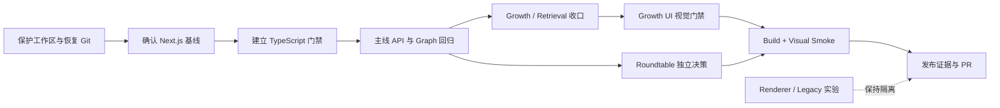

# Anicca 主线质量与发布收口 Implementation Plan

> **For agentic workers:** REQUIRED SUB-SKILL: Use superpowers:subagent-driven-development (recommended) or superpowers:executing-plans to implement this plan task-by-task. Steps use checkbox (`- [ ]`) syntax for tracking.

**Goal:** 在不改变已确认产品架构的前提下，把当前 `/dialogue` 主线、A2A Growth、retrieval 与可选 roundtable 改动从“功能基本完成但混在脏工作区”推进到“仓库健康、验证链完整、变更边界清晰、可审查发布”的状态。

**Architecture:** 继续以 `src/store/branchGraph.ts` 为唯一对话谱系真相源；`/api/branches`、`/api/synthesis` 保持无状态内容生成；UI 只消费 `graph -> view-model` 投影；workspace 维持 local-first、versioned snapshot；Growth 是附加语义层，不改写 `正 / 反 / 合`；retrieval 默认关闭；roundtable 作为独立 sidecar 决策；shader、metaball、raymarching 与 legacy 页面不进入本轮主线发布。

**Tech Stack:** Next.js 15.5.4（本计划推荐的发布基线，需在执行前确认）、React 18、TypeScript、Zustand、OpenAI Responses API、Vitest、Testing Library、Playwright（仅用于关键发布视觉门禁）

**Master Plan:** `docs/superpowers/plans/2026-04-23-anicca-dialectic-v2-mainline.md`

**Design Spec:** `docs/superpowers/specs/2026-04-23-anicca-dialectic-v2-mainline-design.md`

---

## 1. 本计划的定位

本文件是主计划下的“质量与发布收口执行切片”，不是新的产品架构。

- 主计划继续拥有产品语义、系统边界、端口与 rollout policy。
- 本计划拥有 2026-07-26 之后的仓库恢复、工具链决策、质量门禁、变更拆分与发布证据。
- `docs/superpowers/plans/2026-06-11-anicca-a2a-growth-agent-implement-plan.md` 继续记录 Growth 第一阶段设计与完成历史；本计划接管其剩余发布门禁。
- 发生冲突时，优先级为：主计划产品契约 > 设计规格 > 本收口计划 > 历史切片中的旧状态记录。
- 未经用户明确确认，不执行删除缓存、清理 worktree、切换框架版本、推送分支、创建 PR、调用真实付费模型或启动多 agent。

## 2. 2026-07-26 当前状态快照

### 2.1 总体结论

项目处于“功能实现中后期、发布收口前”。

- 核心正反合与当前新增 Growth/Retrieval 逻辑的自动化测试表现良好。
- 目前不能宣称 release-ready：Git 对象库不健康、磁盘空间不足、TypeScript 独立类型门禁失败、生产构建与最新视觉 smoke 尚未完成。
- 当前最大风险不是已确认的业务逻辑回归，而是仓库恢复能力、工具链漂移和缺失的发布级证据。

### 2.2 已取得的验证结果

| 检查项 | 当前结果 | 判定 |
|---|---:|---|
| `npm test` | 26 个测试文件、211 个测试全部通过 | 通过 |
| Growth + Retrieval 定向测试 | 8 个测试文件、56 个测试全部通过 | 通过 |
| `npm run lint` | 0 errors、36 warnings | 条件通过；需归类 warnings |
| `git diff --check` | 无 whitespace error | 通过 |
| `npx tsc --noEmit --incremental false` | 失败 | 阻塞 |
| 注入 Vitest/jest-dom 类型后的 TypeScript | 仅余 `DialogueShell.test.tsx` 10 个测试类型错误 | 可收敛 |
| `npm run build` | 本轮未运行 | 阻塞 |
| `npm run test:visual-dialogue` | 本轮未运行，现有产物已过期 | 阻塞 |
| 真实 provider 50 例评测 | 本轮未运行 | 成本授权后可选 |

### 2.3 工作区与仓库健康

| 项目 | 当前事实 | 风险 |
|---|---|---|
| 当前分支 | `codex/dialogue-immersive-flow-followup` | 可继续审计 |
| 相对 `origin/main` | 0 behind / 23 ahead | 有较大未合并距离 |
| tracked 改动 | 32 个文件，约 +2118 / -747 | 多条功能线混合 |
| untracked 改动 | 审计时 20 个业务文件，聚合为 8 个 status path；不含本计划文档 | 尚无 Git 保护 |
| 可用磁盘 | 约 615 MiB，数据卷显示 100% | 无法可靠安装、构建、跑浏览器 |
| `git fsck --full --no-reflogs` | missing objects、broken links、stale worktree index | 发布阻塞 |
| worktree 元数据 | 1 个 prunable 临时 worktree；3 个零 HEAD worktree | 需备份后修复 |

### 2.4 功能推进状态

| 模块 | 当前进度 | 本轮发布结论 |
|---|---|---|
| `/dialogue` 正反合主线 | 核心架构与主要交互已落地，回归测试通过 | 进入收口 |
| Workspace local persistence | 已有 versioned snapshot 与恢复测试 | 保持主线 |
| Request matching / stale response | 已覆盖测试 | 保持主线 |
| Provider error / output normalization | 已有实现改动，缺独立单元测试与最终类型门禁 | 补齐后合入 |
| A2A Growth 第一阶段 | Units 1–8 完成；全量测试已补跑通过 | 缺视觉门禁 |
| Retrieval 工程层 | 查询与 Growth relation 已完成测试 | 默认关闭，产品 rollout 后置 |
| Roundtable deepen / theater | 工作区存在实现改动 | 独立决策、独立 commit/PR |
| Shader / Metaball / Raymarching | 工作区存在实验改动 | 不进入本轮主线 |
| 云端 persistence、`/api/growth` | 未进入本轮范围 | 延后 |

## 3. 不可破坏的主线契约

### 3.1 Graph 与 UI

- `BranchGraphStore` 是 graph mutation 的唯一入口，UI 不直接改 `nodes` 或 `edges`。
- `deriveDialogueView` 等 view-model 负责 graph 到 sidebar、breadcrumb、stage、panel、composer 的投影。
- `合` 必须同时保留 `sourceNodeIds` 与 `lineageParentId`；breadcrumb 沿 lineage，来源信息单独注入。
- focus-to-compose、requestId matching、workspace session matching 与 stale response 丢弃规则不得弱化。
- 所有 graph 变化必须保持序列化、导出、导入和 reload 恢复兼容。

### 3.2 API

- `/api/branches` 和 `/api/synthesis` 只生成结构化内容，不持久化 graph。
- caller error 返回 `400`；模型结构无效返回 `502 invalid_model_output`；provider 故障使用统一可判定 details。
- API 响应原样回显 `requestId`。
- `/api/chat` 仅保持 legacy 兼容，不成为主线 graph mutation API。

### 3.3 Growth 与 Retrieval

- Growth 使用普通 `user` / `assistant` 节点和 namespaced `meta.growth`，不新增第一阶段 node kind。
- `counter_aha` 不是 canonical `反`；`merge_promote` 不是 canonical `合`。
- Growth edge 使用明确的 `growth:*` reason，不能混入 dialectic lineage。
- 第一阶段继续使用本地、确定性 orchestration，不新增 `/api/growth`。
- Retrieval 在工程层可用，但默认关闭；本轮不把隐式记忆检索开放给所有用户。
- turn-scoped affect 不写入长期记忆；长期记忆写入必须有显式 policy、provenance 和用户控制。

### 3.4 视觉与实验边界

- `/dialogue` 继续使用稳定 DOM/SVG/CSS 舞台。
- `src/components/MetaballCanvas.tsx`、`src/components/RaymarchingCanvas.tsx`、`src/components/archived/MochiCanvas.tsx` 与实验页面不得成为主线依赖。
- renderer 回接必须另开设计与性能计划，并继续消费 `branchGraph -> view-model`。
- roundtable 若进入发布，只作为明确入口的 sidecar，不接管 composer、focus 或 canonical branch 语义。

## 4. 本轮范围

### 4.1 必须完成

- 保护当前所有 tracked 与 untracked 工作。
- 恢复足够磁盘空间和 Git 对象库健康。
- 确认 Next.js 发布基线，并让主计划与实际依赖一致。
- 建立 production 与 test 两套明确的 TypeScript 门禁。
- 补齐 provider error 和 dialectic output normalization 单测。
- 对主线、Growth、Retrieval 做完整回归。
- 给 Growth `/dialogue` 入口补视觉 smoke。
- 通过 lint、typecheck、tests、production build、关键视觉 smoke。
- 把 mainline、Growth、roundtable、renderer 实验拆成可审查边界。
- 生成带日期、命令、结果与产物路径的发布证据。

### 4.2 条件完成

- Roundtable 仅在用户确认纳入本次发布后执行其完整门禁。
- 真实 provider 50 例仅在用户确认 API 成本和数据发送范围后执行。
- 推送远端和创建 PR 仅在用户明确授权后执行。

### 4.3 明确不做

- renderer/shader 回接。
- 云端 graph persistence 或账号同步。
- `/api/growth`。
- retrieval 默认开启或面向真实用户 rollout。
- cross-context graft。
- 多模型 orchestration。
- 删除 legacy/experimental 页面。

## 5. 发布依赖顺序



## 6. 文件边界

### 6.1 主线与 API

- `src/app/api/branches/route.ts`
- `src/app/api/synthesis/route.ts`
- `src/app/api/chat/route.ts`
- `src/app/api/__tests__/dialectic-routes.test.ts`
- `src/features/dialectic/outputContract.ts`
- `src/lib/openai/providerErrors.ts`
- `src/store/branchGraph.ts`
- `src/types/anicca.ts`

### 6.2 Growth 与 Retrieval

- `src/features/growth/types.ts`
- `src/features/growth/userEvent.ts`
- `src/features/growth/artworkAgents.ts`
- `src/features/growth/router.ts`
- `src/features/growth/orchestrator.ts`
- `src/features/growth/graphProjection.ts`
- `src/features/growth/*.test.ts`
- `src/features/retrieval/types.ts`
- `src/features/retrieval/workspaceGraphQuery.ts`
- `src/features/retrieval/workspaceGraphQuery.test.ts`

### 6.3 `/dialogue` UI

- `src/components/dialogue/DialogueComposer.tsx`
- `src/components/dialogue/DialogueShell.tsx`
- `src/components/dialogue/DialogueShell.module.css`
- `src/components/dialogue/DialogueShell.test.tsx`
- `scripts/visual-smoke/dialogue.mjs`

### 6.4 Roundtable 独立切片

- `src/app/api/roundtable/route.ts`
- `src/app/api/roundtable/roundtable-route.test.ts`
- `src/app/roundtable/page.tsx`
- `src/app/roundtable/RoundtableWorkbench.module.css`
- `/dialogue` 中仅与 roundtable drawer/deepen/theater 相关的 hunk

### 6.5 本轮不得混入主线的实验文件

- `src/app/mochi/page.tsx`
- `src/app/newframe/page.tsx` 中超出 legacy banner/entry contract 的实验改动
- `src/app/raymarching/page.tsx`
- `src/components/MetaballCanvas.tsx`
- `src/components/RaymarchingCanvas.tsx`
- `src/components/archived/MochiCanvas.tsx`

## 7. 实施任务

### Task 1: 保护当前工作并恢复执行环境

**Files:**

- Preserve: 当前工作区全部 tracked 与 untracked 文件
- Inspect: `.git/worktrees/**`
- Inspect: `.next/`, `node_modules/`, `artifacts/`, `.worktrees/`

**Steps:**

- [ ] 记录当前分支、HEAD、远端差异、`git status --short`、`git diff --stat` 和磁盘占用。
- [ ] 在仓库外创建带日期的备份目录，例如 `../Anicca-closeout-backup-2026-07-26/`。
- [ ] 用 `git diff --binary` 保存 tracked patch。
- [ ] 显式归档当前 20 个 untracked 文件；归档范围必须来自 `git ls-files --others --exclude-standard` 的审核结果，不使用未核对的广泛 glob。
- [ ] 对 patch 和归档生成 `shasum -a 256`，并在另一个临时目录验证归档可列出、patch 可读取。
- [ ] 请求用户确认后，仅清除可再生缓存和已确认废弃的 worktree 数据；不删除源码、测试、文档或唯一 artifacts。
- [ ] 将数据卷可用空间恢复到至少 10 GiB，再运行依赖安装、production build 或 Playwright。
- [ ] 运行 `git worktree prune --dry-run --verbose`，逐项核对 prunable 目标。
- [ ] 用户确认清理目标后运行 `git worktree prune --verbose`。
- [ ] 运行 `git fetch --all --prune --tags`，尝试补回远端可达对象。
- [ ] 运行 `git fsck --full` 和 `git log --all --oneline -20`。
- [ ] 若仍有 reachable missing object，在 `../Anicca-recovered/` 做全新 clone；把已验证的 tracked patch 与 untracked archive 应用到新 clone，不 reset 当前工作区。

**Exit gate:**

- [ ] `git fsck --full` 不再报告 missing object 或 broken link。
- [ ] `git worktree list --porcelain` 不再包含零 HEAD 或已丢失 gitdir 的条目。
- [ ] 所有当前工作都有仓库外、带 checksum 的可恢复副本。
- [ ] 可用磁盘不少于 10 GiB。

### Task 2: 建立干净的发布收口分支与变更清单

**Files:**

- Create worktree: `../Anicca-mainline-release-closeout/`
- Create inventory: `docs/superpowers/plans/2026-07-26-anicca-mainline-quality-release-closeout-implementation-plan.md`

**Steps:**

- [ ] 在 Git 健康后，从当前已提交 HEAD 创建 `codex/anicca-mainline-release-closeout`。
- [ ] 使用 `git worktree add -b codex/anicca-mainline-release-closeout ../Anicca-mainline-release-closeout HEAD`。
- [ ] 按第 6 节文件边界生成 mainline、Growth/Retrieval、roundtable、renderer/legacy 四组独立 patch。
- [ ] 只把已确认进入主线的 patch 和 untracked 文件应用到 closeout worktree。
- [ ] 使用 `git diff --name-status` 与 `git diff --stat` 复核每组边界。
- [ ] 对同时包含 Growth、roundtable 与普通 dialogue 改动的文件使用 hunk 级拆分，不按整文件粗暴归类。
- [ ] 保留实验改动于原工作区和备份中，不删除、不覆盖、不带入 closeout PR。

**Exit gate:**

- [ ] closeout worktree 不包含第 6.5 节实验改动。
- [ ] 每个变更文件都只有一个明确 owner slice。
- [ ] 原工作区与备份仍可恢复全部实验工作。

### Task 3: 确认并固定框架发布基线

**Files:**

- Modify: `package.json`
- Modify: `package-lock.json`
- Modify: `eslint.config.mjs`
- Modify: `next.config.js`
- Generate: `next-env.d.ts`
- Conditional create: `docs/decisions/2026-07-26-next-16-canary-baseline.md`

**Decision gate:**

- [ ] 用户确认本次发布使用稳定的 Next.js 15.5.4，或明确选择继续使用 `16.3.0-canary.24`。

**Recommended path — stable release baseline:**

- [ ] 将 `next` 和 `eslint-config-next` 固定为 `15.5.4`，保持 React 18。
- [ ] 从最后一次已验证的 Next 15 配置恢复兼容的 ESLint/Next 配置，不保留只为 canary 绕过的规则关闭。
- [ ] 重新生成 lockfile；不手写 `next-env.d.ts`。
- [ ] 运行 `npm ci`。
- [ ] 运行 `npx next --version`，预期输出 `15.5.4`。
- [ ] 运行 `npm run lint` 和 `npm test`，确认框架回退没有引入回归。

**Alternative path — retain canary:**

- [ ] 创建并评审 `docs/decisions/2026-07-26-next-16-canary-baseline.md`，记录升级动机、已知风险、回退方式与额外验证。
- [ ] 同步更新主计划中的 Tech Stack，不允许文档仍声称 Next 15。
- [ ] 逐条审查 `react-hooks/purity`、`react-hooks/refs`、`react-hooks/set-state-in-effect` 的关闭原因；主线文件不得用全局关规则掩盖真实问题。
- [ ] 对 Next 16 canary 单独完成 build、route、hydration、lint 和视觉回归后，才允许继续发布。

**Commit:**

```bash
git add package.json package-lock.json eslint.config.mjs next.config.js next-env.d.ts
git commit -m "chore(toolchain): restore verified mainline baseline"
```

### Task 4: 建立 production/test 双 TypeScript 门禁

**Files:**

- Modify: `tsconfig.json`
- Create: `tsconfig.test.json`
- Modify: `package.json`
- Create: `tests/deferred.ts`
- Modify: `src/components/dialogue/DialogueShell.test.tsx`

**Steps:**

- [ ] 先运行 `npx tsc --noEmit --incremental false`，保留当前失败输出作为 red evidence。
- [ ] 在 `tsconfig.json` 排除 `**/*.test.ts`、`**/*.test.tsx` 与 `src/**/__tests__/**`，使 production gate 只检查应用源码。
- [ ] 创建 `tsconfig.test.json`，extends production config，并显式加入 `node`、`vitest/globals`、`@testing-library/jest-dom` 类型。
- [ ] 在 test config 中包含 `src/**/*.test.ts`、`src/**/*.test.tsx`、`src/**/__tests__/**`、`tests/**/*.ts` 与 `vitest.config.ts`。
- [ ] 创建 typed `createDeferred<T>()` helper，替换 `DialogueShell.test.tsx` 中 nullable resolver closure。
- [ ] 将 `URL.createObjectURL` mock 参数声明为 `Blob`，避免零参数 tuple 推断。
- [ ] 用 `satisfies PersistedWorkspaceSnapshot` 或显式类型标注固定 `schemaVersion` literal。
- [ ] 在 `package.json` 增加：

```json
{
  "typecheck": "tsc --noEmit --incremental false",
  "typecheck:test": "tsc -p tsconfig.test.json --noEmit --incremental false",
  "check": "npm run lint && npm run typecheck && npm run typecheck:test && npm test"
}
```

- [ ] 运行 `npm run typecheck`，预期 0 errors。
- [ ] 运行 `npm run typecheck:test`，预期 0 errors。
- [ ] 运行 `npx vitest run src/components/dialogue/DialogueShell.test.tsx`，预期全部通过。

**Commit:**

```bash
git add tsconfig.json tsconfig.test.json package.json tests/deferred.ts src/components/dialogue/DialogueShell.test.tsx
git commit -m "test(types): add explicit production and vitest gates"
```

### Task 5: 收口 provider error 与 dialectic output contract

**Files:**

- Create: `src/features/dialectic/outputContract.test.ts`
- Modify: `src/features/dialectic/outputContract.ts`
- Create: `src/lib/openai/providerErrors.test.ts`
- Modify: `src/lib/openai/providerErrors.ts`
- Modify: `src/app/api/__tests__/dialectic-routes.test.ts`
- Modify: `src/app/api/branches/route.ts`
- Modify: `src/app/api/synthesis/route.ts`
- Modify: `src/app/api/chat/route.ts`

**Steps:**

- [ ] 为 label whitespace、中文分隔符、ASCII fallback、8 字截断与受保护“结合/整合/融合/综合/配合/适合/合流”后缀先写失败测试。
- [ ] 为 missing key、401/auth、429/rate limit、provider overloaded、network/timeout 与 unknown runtime error 先写失败测试。
- [ ] 每个 provider error 测试恢复原始 `process.env.OPENAI_API_KEY`，避免跨测试污染。
- [ ] 在 route contract 测试中覆盖 malformed JSON、缺字段、prose/code fence、requestId echo 与稳定 error body。
- [ ] 运行下面的定向测试，确认新增测试先红后绿：

```bash
npx vitest run \
  src/features/dialectic/outputContract.test.ts \
  src/lib/openai/providerErrors.test.ts \
  src/app/api/__tests__/dialectic-routes.test.ts
```

- [ ] 确认 route failure 不创建 graph node，不留下 pending state，不把 provider 原始敏感内容直接展示给用户。
- [ ] 运行 `npm run typecheck` 与 `npm run typecheck:test`。

**Commit:**

```bash
git add \
  src/features/dialectic/outputContract.ts \
  src/features/dialectic/outputContract.test.ts \
  src/lib/openai/providerErrors.ts \
  src/lib/openai/providerErrors.test.ts \
  src/app/api/__tests__/dialectic-routes.test.ts \
  src/app/api/branches/route.ts \
  src/app/api/synthesis/route.ts \
  src/app/api/chat/route.ts
git commit -m "feat(api): harden dialectic output and provider errors"
```

### Task 6: 重新证明主线核心契约

**Files:**

- Test: `src/lib/openai/readOutputText.test.ts`
- Test: `src/store/branchGraph.test.ts`
- Test: `src/chat/context.test.ts`
- Test: `src/chat/workspaceContext.test.ts`
- Test: `src/features/dialectic/store.test.ts`
- Test: `src/features/dialectic/viewModel.test.ts`
- Test: `src/lib/persist/local.test.ts`
- Test: `src/lib/persist/workspaces.test.ts`
- Test: `src/app/api/__tests__/dialectic-routes.test.ts`
- Test: `src/components/dialogue/BubbleStage.test.tsx`
- Test: `src/components/dialogue/WorkspaceBar.test.tsx`
- Test: `src/components/dialogue/DialogueShell.test.tsx`
- Test: `src/app/__tests__/entrypoint-smoke.test.tsx`

**Steps:**

- [ ] 运行主线定向回归：

```bash
npx vitest run \
  src/lib/openai/readOutputText.test.ts \
  src/store/branchGraph.test.ts \
  src/chat/context.test.ts \
  src/chat/workspaceContext.test.ts \
  src/features/dialectic/store.test.ts \
  src/features/dialectic/viewModel.test.ts \
  src/lib/persist/local.test.ts \
  src/lib/persist/workspaces.test.ts \
  src/app/api/__tests__/dialectic-routes.test.ts \
  src/components/dialogue/BubbleStage.test.tsx \
  src/components/dialogue/WorkspaceBar.test.tsx \
  src/components/dialogue/DialogueShell.test.tsx \
  src/app/__tests__/entrypoint-smoke.test.tsx
```

- [ ] 确认 root 输入、第二轮 continuation、focus 切换、`合` 生成与 `合` 后续 continuation 全部被覆盖。
- [ ] 确认 stale branches/synthesis response 不写 graph、不抢 focus。
- [ ] 确认 workspace reload 不恢复 in-flight request。
- [ ] 确认 `/` 仍进入 `/dialogue`，`/newframe` 仍明确标记为 legacy，而不是主入口。
- [ ] 运行 `npm test`，测试总数不得少于当前基线 211。

**Exit gate:**

- [ ] 主线定向回归 100% 通过。
- [ ] 全量 Vitest 100% 通过。
- [ ] 没有通过删除断言、跳过测试或降低契约来换取 green。

### Task 7: 收口 Growth 与 Retrieval domain slice

**Files:**

- Modify/Create: `src/features/growth/*.ts`
- Modify/Create: `src/features/growth/*.test.ts`
- Modify: `src/features/retrieval/types.ts`
- Modify: `src/features/retrieval/workspaceGraphQuery.ts`
- Modify: `src/features/retrieval/workspaceGraphQuery.test.ts`
- Modify: `src/store/branchGraph.ts`
- Modify: `src/types/anicca.ts`
- Modify after verification: `docs/superpowers/plans/2026-06-11-anicca-a2a-growth-agent-implement-plan.md`

**Steps:**

- [ ] 复核 `UserAgentEvent`、`ArtworkAgentProfile`、`GrowthOperator`、`GrowthSession` 全部可序列化。
- [ ] 复核 `createGrowthAssistant` 是 Growth assistant 的唯一 store 写入帮助函数。
- [ ] 复核 `graphProjection` 不改变 canonical branch ordering，也不伪造 `正 / 反 / 合`。
- [ ] 复核 retrieval 可查询 growth operator、artwork id 与 edge reason，同时保持 synthesis source backfill。
- [ ] 运行：

```bash
npx vitest run \
  src/features/growth/*.test.ts \
  src/features/retrieval/workspaceGraphQuery.test.ts \
  src/store/branchGraph.test.ts
```

- [ ] 确认 100-example deterministic test 无网络、无时间依赖、结果稳定。
- [ ] 确认 retrieval feature flag 仍默认关闭。
- [ ] 在验证完成后，把 Growth 计划 Unit 9 的 full test 状态更新为已完成；visual 状态只在 Task 8 通过后更新。

**Commit:**

```bash
git add src/features/growth src/features/retrieval src/store/branchGraph.ts src/types/anicca.ts docs/superpowers/plans/2026-06-11-anicca-a2a-growth-agent-implement-plan.md
git commit -m "feat(growth): add local artwork growth graph layer"
```

### Task 8: 收口 `/dialogue` Growth UI 与关键视觉门禁

**Files:**

- Modify: `src/components/dialogue/DialogueComposer.tsx`
- Modify: `src/components/dialogue/DialogueShell.tsx`
- Modify: `src/components/dialogue/DialogueShell.module.css`
- Modify: `src/components/dialogue/DialogueShell.test.tsx`
- Modify: `scripts/visual-smoke/dialogue.mjs`

**Steps:**

- [ ] 先补失败测试：选择“画作视角”后，submit 走本地 Growth path，不调用 `/api/branches`。
- [ ] 补测试：Growth 写入 user event、多个 artwork response、`meta.growth` provenance 与明确 edge reason。
- [ ] 补测试：从 Growth 返回 canonical 正反合模式后，composer target、focus 与 pending state 不残留。
- [ ] 补测试：用户可看到“画作视角/共鸣/反方 aha/合并提拔”等中性文案，不出现永久人格判断。
- [ ] 在 `scripts/visual-smoke/dialogue.mjs` 增加 `ensureGrowthPerspectiveFlow(browser)`。
- [ ] 视觉 scenario 至少覆盖 desktop 1440×980、mobile 390×844 和 mobile 320×740。
- [ ] 检查 Growth choice target ≥44px、键盘可达、focus 可见、mobile 无横向 overflow、composer 不遮挡结果。
- [ ] 保留现有 synthesis pending、stale synthesis、choice dock、retrieval debug 与 roundtable focus-return scenarios。
- [ ] 运行 `npx vitest run src/components/dialogue/DialogueShell.test.tsx`。
- [ ] Task 10 视觉 smoke 通过后，再把 Growth 计划 Unit 9 的 visual checkbox 标为完成。

**Commit:**

```bash
git add src/components/dialogue/DialogueComposer.tsx src/components/dialogue/DialogueShell.module.css
git add -p src/components/dialogue/DialogueShell.tsx src/components/dialogue/DialogueShell.test.tsx scripts/visual-smoke/dialogue.mjs
git add docs/superpowers/plans/2026-06-11-anicca-a2a-growth-agent-implement-plan.md
git commit -m "feat(dialogue): expose artwork growth perspectives"
```

### Task 9: 对 Roundtable 做独立发布决策

**Files:**

- Conditional modify: `src/app/api/roundtable/route.ts`
- Conditional modify: `src/app/api/roundtable/roundtable-route.test.ts`
- Conditional modify: `src/app/roundtable/page.tsx`
- Conditional modify: `src/app/roundtable/RoundtableWorkbench.module.css`
- Conditional modify: `src/components/dialogue/DialogueShell.tsx`
- Conditional modify: `src/components/dialogue/DialogueShell.test.tsx`
- Conditional modify: `scripts/visual-smoke/dialogue.mjs`

**Decision gate:**

- [ ] 用户选择“本次纳入”或“保存为后续独立 slice”；默认推荐后者，以降低主线收口耦合。

**If included:**

- [ ] API 先覆盖 caller error、provider error、requestId 与 structured response。
- [ ] UI 先覆盖 drawer open/close、focus return、deepen request pending/stale/error。
- [ ] Theater mode 必须保留退出路径、reduced motion 与 mobile fallback。
- [ ] Roundtable 输出不得写成 canonical `正 / 反 / 合`，除非用户显式选择投影。
- [ ] 运行：

```bash
npx vitest run \
  src/app/api/roundtable/roundtable-route.test.ts \
  src/components/dialogue/DialogueShell.test.tsx
```

- [ ] 扩展视觉 smoke 覆盖 drawer focus return、deepen 成功/失败与 theater 退出。
- [ ] 独立提交：

```bash
git add src/app/api/roundtable src/app/roundtable
git add -p src/components/dialogue/DialogueShell.tsx src/components/dialogue/DialogueShell.test.tsx src/components/dialogue/DialogueShell.module.css scripts/visual-smoke/dialogue.mjs
git commit -m "feat(roundtable): add opt-in dialogue sidecar"
```

**If deferred:**

- [ ] 不把 roundtable 相关 hunk 应用到 closeout worktree。
- [ ] 保留独立 patch、原工作区与 checksum 备份。
- [ ] 主线 choice dock 不显示尚未发布的 roundtable 入口。

### Task 10: 完成全量发布门禁

**Files:**

- Modify: `README.md`
- Generate: `artifacts/visual-smoke/dialogue/**`
- Conditional generate: `artifacts/dialectic-50-live/2026-07-26/**`
- Create: `docs/superpowers/plans/2026-07-26-anicca-mainline-release-closeout-report.md`

**Steps:**

- [ ] 运行 `git diff --check`。
- [ ] 运行 `npm run check`。
- [ ] 归类当前 36 个 lint warnings；主线 owned files 必须为 0 warning，实验文件的剩余 warning 必须记录 owner 且不得增加。
- [ ] 运行 `npm run build`，预期 Next production build 成功。
- [ ] 运行 `DIALOGUE_SMOKE_SERVER_MODE=start npm run test:visual-dialogue`。
- [ ] 人工审阅 `artifacts/visual-smoke/dialogue/summary.json` 与所有当前日期截图。
- [ ] 确认 desktop、tablet、touch、390/360/320 mobile 无遮挡、横向溢出、焦点丢失或不可点击控件。
- [ ] 更新 `README.md` 的 validation gate，加入 `npm run typecheck`、`npm run typecheck:test`、`npm test`、`npm run build`、`npm run test:visual-dialogue`。
- [ ] 创建 closeout report，写入 commit SHA、Node/npm/Next 版本、每条命令、退出码、测试数量、warning 数量、artifact 路径和未启用 feature flags。

**Optional live-provider gate — only after explicit cost approval:**

- [ ] 运行 `node --check scripts/evals/dialectic-50-live.mjs`。
- [ ] 用本地 production server 和独立输出目录运行：

```bash
ANICCA_EVAL_BASE_URL=http://127.0.0.1:3060 \
ANICCA_EVAL_OUTPUT_DIR=artifacts/dialectic-50-live/2026-07-26 \
node scripts/evals/dialectic-50-live.mjs
```

- [ ] 检查 50 例 contract pass rate、quality warnings、retry count 和 P95/长尾延迟。
- [ ] 报告中不得记录 API key、authorization header 或用户私人数据。

**Exit gate:**

- [ ] `npm run lint` 无 error，mainline 文件无 warning。
- [ ] production 与 test TypeScript 均 0 errors。
- [ ] 全量 Vitest 100% 通过，测试数量不低于 211。
- [ ] production build 通过。
- [ ] 当前代码生成的视觉 smoke 全部通过并完成人工审阅。
- [ ] closeout report 能让另一位开发者复现全部门禁。

**Commit:**

```bash
git add README.md artifacts/visual-smoke/dialogue docs/superpowers/plans/2026-07-26-anicca-mainline-release-closeout-report.md
git commit -m "docs(release): record mainline closeout evidence"
```

### Task 11: 最终审查与远端交付

**Files:**

- Review: closeout branch 全部变更
- No source mutation unless review finds a confirmed defect

**Steps:**

- [ ] 运行 `git status --short`，确认没有遗漏或意外文件。
- [ ] 运行 `git diff origin/main...HEAD --stat`，确认 PR 范围与第 4 节一致。
- [ ] 运行 `git log --oneline origin/main..HEAD`，确认 commit 可按 toolchain、API、Growth domain、Growth UI、可选 roundtable、release evidence 独立审查。
- [ ] 再运行一次 `npm run check && npm run build`。
- [ ] 再运行一次 production-mode visual smoke。
- [ ] 审查 `.npmrc`、eval artifacts 与 logs，确认无 token、key、私人数据或本机绝对敏感路径。
- [ ] 用户明确授权后再 push `codex/anicca-mainline-release-closeout`。
- [ ] 用户明确授权后再创建 PR；PR 必须列出已通过门禁、未启用 flags、roundtable 决策与 renderer deferred 状态。

## 8. 推荐 Commit / PR 切片

1. `chore(toolchain): restore verified mainline baseline`
2. `test(types): add explicit production and vitest gates`
3. `feat(api): harden dialectic output and provider errors`
4. `feat(growth): add local artwork growth graph layer`
5. `feat(dialogue): expose artwork growth perspectives`
6. `feat(roundtable): add opt-in dialogue sidecar`（仅确认纳入时）
7. `docs(release): record mainline closeout evidence`

每个切片必须独立通过与自身相关的定向测试；最终 PR 再通过全量门禁。Renderer/legacy 实验不出现在以上 commits。

## 9. 最终发布判定

### 可进入 PR review

- Git 对象库与 worktree metadata 健康。
- 磁盘满足可复现构建。
- 框架版本已确认并与主计划一致。
- 主线、Growth、Retrieval 的类型、测试、build 和视觉门禁通过。
- Roundtable 已明确纳入或隔离。
- 实验渲染改动已隔离。
- 变更可按 commit 边界审查。

### 可声明 release-ready

- PR review 无 P0/P1 问题。
- 所有必需门禁在 PR 最终 SHA 上重新通过。
- 视觉产物来自最终 SHA，不使用 2026-05-23 的旧截图。
- provider/live eval 若未执行，release note 明确标记“真实模型质量尚未复验”，不得将 unit/integration pass 等同于 provider quality pass。
- retrieval 保持默认关闭，除非另有 rollout 决策与用户控制。

### 继续阻塞发布

- `git fsck` 仍有 missing reachable object。
- 磁盘不足导致 install/build/browser 结果不稳定。
- production 或 test TypeScript 任一失败。
- build 或关键视觉 smoke 未完成。
- Next 15/16 canary 基线尚未确认。
- roundtable/renderer 实验仍与主线 commit 混杂。

## 10. 当前推荐决策

1. 先恢复仓库与磁盘，再做任何代码收口；这是当前唯一 P0。
2. 本次发布回到已验证的 Next.js 15.5.4；Next 16 canary 另开升级计划。
3. Growth 第一阶段进入本轮主线，但 retrieval 继续默认关闭。
4. Roundtable 先保存为独立 slice，完成单独视觉验收后再决定是否纳入。
5. Renderer/legacy 改动保持隔离，不阻塞稳定 `/dialogue` 发布。
6. 真实 provider 50 例属于付费、外部依赖验证；在 build 与视觉门禁通过后，再由用户决定是否执行。
