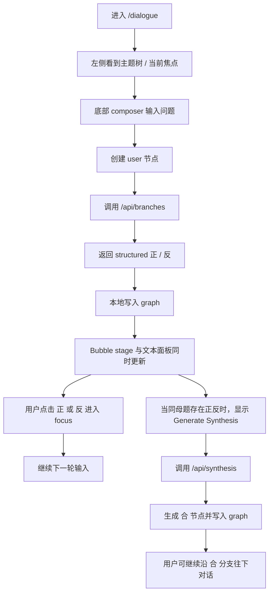

# Anicca Dialectic V2 Mainline Design

在同一仓库内重开一条新的产品主线，而不是继续把 `/newframe` 补成最终形态。

**Recommended branch:** `codex/dialectic-v2-mainline`

## Motivation

Anicca 现在同时存在三套彼此竞争的心智模型：

- `README.md` 仍然描述“三泡泡回应 + 止语”
- `docs/项目介绍.md` 和 `docs/1_新对话技术路径文档.md` 已经转向“两分形 + 合”
- 当前用户可见入口 `src/app/newframe/page.tsx` 对应的实现仍然是“球体 split/merge demo”，而不是真正的多轮对话产品

这导致三个后果：

1. 用户不知道自己是在操作“分支对话”还是“物理球体”
2. `src/store/branchGraph.ts`、`src/chat/context.ts`、`src/llm/runner.ts` 这条 DAG 链路没有进入主 UI
3. 任何继续在 `/newframe` 上补功能的行为，都会把语义层和演示层继续缠在一起

这份设计的核心目标是：在不另起仓库的前提下，为 Anicca 建立一条可交付、可演进、可验证的新主线。

## Decision Summary

### 1. 产品语义正式收敛为“两分形 + 合”

- 每轮只生成两个分支：`正`、`反`
- `合` 不是第三颗常驻气泡，而是由用户显式触发或由条件满足后触发的“新节点”
- 不再把“止语 / mute”放在主产品路径里

### 2. 保留同仓库，冻结旧入口

- 新主入口使用 `src/app/dialogue/page.tsx`
- 根路由 `src/app/page.tsx` 最终重定向到 `/dialogue`
- `src/app/newframe/page.tsx` 保留为 legacy experiment，明确标注为旧实验入口

### 3. 以图结构为真相源，不再以球体 store 为真相源

- `src/store/branchGraph.ts` 继续承担对话谱系真相源
- 新增 UI 状态与视图投影层，将 graph 投影成可显示的 bubble/card/breadcrumb/sidebar
- 渲染层只消费 view model，不直接决定语义

### 4. 新主线先不用现有 WebGPU/Raymarching 作为交付前提

- 第一版主线路径使用可控的 2D/SVG/DOM bubble stage
- `src/components/MetaballCanvas.tsx` 和 `src/components/RaymarchingCanvas.tsx` 暂不作为主线依赖
- 当多轮、fork、synthesis、focus 这些核心交互跑顺后，再决定是否把 shader 视觉重新接入

这是有意为之的降复杂度决策，不是降级审美目标。

## Goals

新主线必须完成以下能力：

1. 用户可以从任意焦点节点继续一轮输入
2. 一次输入会生成结构化的 `正 / 反` 两个回应
3. 用户可以在任意一条分支上继续多轮对话
4. 同一母题下的 `正 / 反` 可以显式生成 `合`
5. UI 中始终可见“当前焦点分支”和它的祖先路径
6. 所有对话状态都可以映射到 graph，并可导出/恢复

## Non-Goals

本设计明确不包含以下内容：

- 不在这一轮主线中整合跨语境 graft / 外部语境磁吸
- 不把 Raymarching/WebGPU 作为主线首发依赖
- 不引入后端数据库；继续保持本地优先和可导出
- 不在这一轮主线中做多模型切换 UI
- 不保留“三泡泡回应”作为主产品概念

## Product Flow



## User Experience

### Screen layout

新主线采用固定三段式布局：

- 左侧：分支树与当前焦点路径
- 中央：Bubble Stage，显示当前焦点相关的节点
- 右侧：当前分支文本内容（desktop）
- 下半区固定 panel：当前分支文本内容（mobile）
- 底部：常驻 composer

用户不再通过 modal 弹窗输入，也不需要先学会拖拽合并这种隐藏手势。

### Focus model

系统中存在一个全局“当前焦点节点”：

- 点击 bubble：切换焦点
- 点击侧栏节点：切换焦点
- 点击 breadcrumb：回到祖先节点

切换焦点后：

- stage 只强调当前节点、祖先链、直接子节点
- 其他节点降噪，而不是彻底消失
- composer 明确显示“当前会在谁下面继续说话”

### Synthesis model

当一个 `user` 节点下已有 `正` 和 `反` 两个 assistant 子节点时，界面显示一个显式操作：

- `Generate Synthesis`

点击后：

- 系统调用 `/api/synthesis`
- 生成一个新的 `合` assistant 节点
- `合` 节点成为这组对立分支的高阶表达
- 用户可以继续在 `合` 节点下创建下一轮 `user -> 正/反`

### Synthesis lineage model

`合` 节点同时承担两种不同职责，这两种职责必须在实现中显式分离：

- `sourceNodeIds`: 指向生成该 `合` 的 `正` / `反` assistant
- `lineageParentId`: 指向这组 `正` / `反` 的共同上游 `user`

这带来以下硬规则：

- breadcrumb 一律沿 `lineageParentId` 及其祖先展开，不在 `sourceNodeIds` 之间二选一
- sidebar tree 将 `合` 展示为该 `lineageParentId` user 的显式子节点
- composer 在焦点为 `合` 时直接续写在该 `合` 之下
- context 在 `合` 或其后代继续时，lineage 通过 `lineageParentId` 提供，source 信息通过 `sourceNodeIds` 单独提供

## Architecture

### 1. Domain graph remains local-first

`src/store/branchGraph.ts` 继续作为对话真相源，但扩展为支持真正的多轮。

graph 中存在两种主节点：

- `user`
- `assistant`

保留 `merge` 类型仅用于兼容旧实现；新主线不再主动创建 `merge` 节点。

`assistant.branchType` 扩展为：

- `正`
- `反`
- `合`

一个标准多轮链路如下：

```text
user(root)
  -> assistant(正)
  -> assistant(反)

assistant(正)
  -> user(next turn)
      -> assistant(正)
      -> assistant(反)
```

`合` 也是 assistant 节点，只是拥有两个 assistant 父节点，并在 `meta.sourceNodeIds` 中记录双来源、在 `meta.lineageParentId` 中记录其共享 lineage anchor。

### 2. Server routes are stateless content generators

server route 不持有 graph，不负责生成本地 node id。

#### `POST /api/branches`

请求：

```json
{
  "requestId": "req_123",
  "userText": "我该不该继续做这个项目",
  "contextMessages": [
    { "role": "system", "content": "你负责同时生成正反两个结构化分支。" },
    { "role": "user", "content": "这个项目现在的主路径没有打通。" }
  ],
  "model": "gpt-4o-mini"
}
```

响应：

```json
{
  "requestId": "req_123",
  "thesis": {
    "text": "继续做，但先缩小目标。",
    "summary": "缩小目标继续做",
    "label": "缩做",
    "stance": "正"
  },
  "antithesis": {
    "text": "先停下，别再给旧 demo 续命。",
    "summary": "先停再重开主线",
    "label": "停修",
    "stance": "反"
  }
}
```

#### `POST /api/synthesis`

请求：

```json
{
  "requestId": "req_456",
  "thesis": {
    "text": "继续做，但先缩小目标。",
    "summary": "缩小目标继续做",
    "label": "缩做",
    "stance": "正"
  },
  "antithesis": {
    "text": "先停下，别再给旧 demo 续命。",
    "summary": "先停再重开主线",
    "label": "停修",
    "stance": "反"
  },
  "contextMessages": [
    { "role": "system", "content": "你负责根据正反分支生成更高阶的合。" }
  ],
  "model": "gpt-4o-mini"
}
```

响应：

```json
{
  "requestId": "req_456",
  "synthesis": {
    "text": "继续做，但只在新主线上推进，旧入口冻结。",
    "summary": "新主线推进旧入口冻结",
    "label": "重开",
    "stance": "合"
  }
}
```

### 3. Context building stays deterministic and local

`src/chat/context.ts` 继续负责上下文裁剪，但新主线不直接把它暴露为“黑盒魔法”。

Context Builder 的职责：

- 从当前焦点 assistant 或其父系 user 回溯最近 5 轮
- 对更老内容做摘要裁剪
- 只把必要内容送入 route
- 当当前节点或上游节点是 `合` 时，额外把 `sourceNodeIds` 的摘要显式注入上下文

UI 不显示权重公式，但显示“当前上下文来自哪些祖先节点”。

### 4. View projection becomes a first-class layer

新增一个显式 view-model 层，将 graph 映射为 UI 可消费数据：

- `breadcrumb`
- `sidebar tree`
- `conversation cards`
- `bubble stage nodes`
- `available synthesis actions`
- `composer target`
- `focused synthesis sources`

这样可以彻底解除“球体布局 = 对话语义”的耦合。

### 5. Bubble Stage is deterministic, not physics-first

首版主线的 central stage 使用确定性 2D 布局：

- 焦点节点在中心
- 祖先沿上方单线递进
- 当前焦点的直接子节点沿左右展开
- 当焦点是 `合` 时：`合` 节点居中，`正` / `反` source 节点固定显示在其左上 / 右上
- 当焦点是生成 `合` 的上游 `user` 时：`正` / `反` 固定左右分居，`合` 固定显示在其正下方

布局必须优先满足：

1. 用户能一眼看懂当前层级
2. 点击和切换稳定
3. 多轮后不因自动物理而抖动

美学由色彩、层级、呼吸动画和模糊发光承担，而不是由真实流体模拟承担。

## Data Model Changes

`src/types/anicca.ts` 的目标形态：

```ts
export type BranchType = "正" | "反" | "合";

export interface AniccaNodeMeta {
  model?: string;
  temperature?: number;
  summary?: string;
  summaryStatus?: "ok" | "missing" | "invalid";
  label?: string;
  sourceNodeIds?: string[];
  lineageParentId?: string;
}
```

关键约束：

- `label` 为 UI 短标签，长度建议 <= 4 字
- `summary` 为单行摘要，长度建议 <= 30 字
- `sourceNodeIds` 用于 `合` 节点记录来源
- `lineageParentId` 用于 `合` 节点统一 breadcrumb / sidebar / context 的祖先规则

## Request Matching

主线实现必须处理“迟到响应写错图”的问题。

硬规则：

- `/api/branches` 与 `/api/synthesis` 的请求都带客户端生成的 `requestId`
- 响应必须原样回显 `requestId`
- 客户端只在 `requestId` 仍匹配当前 active pending slot 时才写 graph
- 焦点切换、重复点击、重试、跨 tab 的旧响应都不得写入当前 graph
- route 成功不等于 graph 可写；必须先通过 request matching

## Workspace Snapshot Versioning

本地恢复不是只存 graph，而是存 versioned workspace snapshot。

硬规则：

- snapshot 至少包含：`schemaVersion`、`workspaceSessionId`、graph snapshot、`focusedNodeId`、`composerParentId`
- `activeRequestId`、`pendingAction`、任意 in-flight request slot 不得跨 reload 恢复
- snapshot 版本不兼容时整包作废并重新进入 fresh workspace
- 首版不要求做跨版本迁移；要求做明确 invalidation

## Routing and Migration

### New path

- `src/app/dialogue/page.tsx` 成为新的正式入口

### Root behavior

- `src/app/page.tsx` 重定向到 `/dialogue`

### Legacy isolation

- `src/app/newframe/page.tsx` 保留，但增加 legacy 提示
- `src/components/MetaballCanvas.tsx`
- `src/components/RaymarchingCanvas.tsx`
- `src/store/metaballStore.ts`

这些文件在新主线第一阶段不再承担产品真相源职责。

## Acceptance Criteria

设计完成后的实现必须满足以下验收条件：

1. `/dialogue` 中用户无需弹窗即可连续输入多轮
2. 每轮输入都生成结构化 `正 / 反`
3. 每个 assistant 节点都能继续生长出下一轮 `user -> 正/反`
4. 同母题下可以显式生成 `合`
5. 当前焦点、祖先路径、可继续分支在 UI 中始终清晰
6. graph 导出与本地恢复包含足够信息恢复对话树与当前工作点，且不会恢复过期 pending 状态
7. 迟到响应不会写入错误的 graph 状态
8. `/newframe` 不被删除，但明确标记为 legacy，不再承担主入口职责

## Risks and Mitigations

### Risk: 新主线和旧实验层继续互相污染

Mitigation:

- 新主线使用 `src/app/dialogue/page.tsx` 和新组件目录
- 旧页面只做最小维护，不再接主链路逻辑

### Risk: 过早回到 WebGPU/Raymarching，导致主线再次失焦

Mitigation:

- 把 shader 集成列为后续 enhancement
- 主线首发以稳定交互和多轮语义为第一优先级

### Risk: 本地 state 和 server route 契约再次漂移

Mitigation:

- route 输出只负责 structured content
- graph id 与谱系关系全部在本地生成
- 为 route contract 和 graph helper 补自动化测试

## Rollout Recommendation

推荐实施顺序：

1. 修正 `src/app/api/chat/route.ts` 的输出解析
2. 扩展 graph 与 types，支持 `合` 和真正多轮
3. 新建 `/api/branches` 与 `/api/synthesis`
4. 新建 `/dialogue` shell、sidebar、composer、bubble stage
5. 根路由切换到 `/dialogue`
6. 将 `/newframe` 显式标为 legacy

## References

- `docs/项目介绍.md`
- `docs/1_新对话技术路径文档.md`
- `docs/完成目标实施计划.md`
- `docs/flow-chat借鉴分析.md`
- `src/store/branchGraph.ts`
- `src/chat/context.ts`
- `src/llm/runner.ts`
