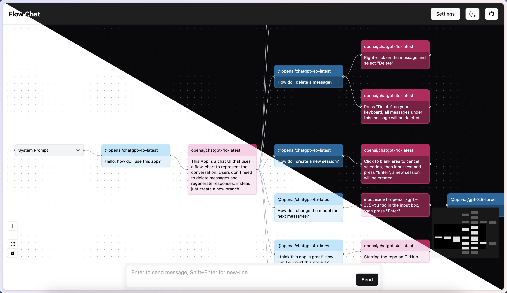

# Flow Chat

[](https://app.netlify.com/sites/flow-chat/deploys)

多分支 LLM 对话 UI。[Demo](https://flow-chat.lemonneko.moe/)



## 特性

- 文本生成：基本的聊天功能
- 图片生成：从文本生成图片
- 分支：从消息创建新分支
- 模型切换：在同一个对话中切换不同的模型

## 开发

```bash
pnpm install
pnpm dev
```

## 构建

```bash
pnpm build
```
